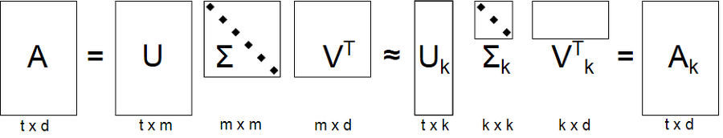

# 2020 Line recruit test

## Models

### Matrix Factorization

In matrix factorization the goal is to estimate matrix $X \in R^{I \times J}$ containing the ratings given by a user $i$ to a movie $j$,  using a matrix decomposition method called Singular Value Decomposition(SVD).

**Collaborative Filtering** is a method of making automatic predictions (filtering) about the interests of a user by collecting preferences or taste information from many users (collaborating). The underlying assumption of the collaborative filtering approach is that if a person *A* has the same opinion as a person *B* on an issue, A is more likely to have B's opinion on a different issue than that of a randomly chosen person.

Simply **SVD** is to decompose a matrix of $m \times n$ into three matrices($U$, $\Sigma$, $V$) as shown below. First, Use the SVD to create a matrix of user matrix($U$), property matrix($\Sigma$) and movie matrix($V$) using given movie ratings.

If you do this, we can get diagonal matrix($\Sigma$) which can called features. Using the computed $U$, $V$, and  key features of $\Sigma$, can create approximate of original matrix.  So, we can predict undefined values, using created $U$, $Sigma$ and $V$.



## Implementations

Python is a simple language that is easy enough to understand directly. So it's not difficult to see and understand the code right away. But here are tips for Python beginners.

### `lib.recommender.Recommender`

Default recommender class. You can choose which algorithm to use for the recommender system, 
but only `factorization` (implement of [*Matrix Factorization Techniques for Recommender Systems*](https://ieeexplore.ieee.org/abstract/document/5197422)) is currently implemented.

### `models.factorization`

This class is basically written in both `Python` and `Cython`. This is because the matrix operation takes too long, so increase the calculation efficiency using `Cython`.
*If `Cython` is not installed, run `Python` backend automatically.*

*Notice*
By default, `.py` and `.pyx` code is supposed to do the same. This is a function for operate acceleration when `Cython` is supported, and if the library is not found, the same result is configured to run in just python. The details of the code may differ slightly due to computational efficiency or `Cython` constraints, but as a result, they perform the same.

This class accepts parameters **factors**, **epochs**, **init_mean**, **init_derivation**, **learning_rate**, **regression_rate**.

And, there are two methods. Simply, `fit` create feature matrix and `predict` return predicted value using created feature matrix.

- `fit`

  Train with train data. Create `bias` and `param` of each user, item. `unique` is indexer to compress given data. Calculate `dot` and `error` to update `bias` and `param`. `lr` and `reg` is rate of update values.

  Calculate current errors at *line 65-66*.

  ```
  dot = sum(param_item[i, f] * param_user[u, f] for f in range(self.factors))
  err = r - (mean + biase_user[u] + biase_item[i] + dot)
  ```

  Update `bias` parts at *line 69-70*.

  ```
  biase_user[u] += self.lr * (err - self.reg * biase_user[u])
  biase_item[i] += self.lr * (err - self.reg * biase_item[i])
  ```

  Update `param` parts at *line 73-74*.

  ```
  param_user[u] += self.lr * (err * param_item[i] - self.reg * param_user[u])
  param_item[i] += self.lr * (err * param_user[u] - self.reg * param_item[i])
  ```

- `predict`

  Return prediction value which create using `bias` and `param` matrix.

## Requirements

- NumPy: is the fundamental package for scientific computing with Python.
- tqdm: is make loops show a smart progress meter.

**Optional**
- Cython: support compiled language, generates `Cython` extension modules, accelerate computing performance.

*install packages using pip*
```
pip install -r requirements.txt
```

*Tested @ python3.7 in Ubuntu 18.04 LTS, macOS Catalina and Windows 10 (WSL2)*

## Run process

First of all, If you want to using `Cython` build it as follow:
```
python setup.py build_ext --inplace
```

And run main script using divided into train and test dataset.
Before that, split train and test dataset using `scripts/split.py`.
Below scripts generate `dataset1_train/test.csv`, `dataset2_train/test.csv` and `tiny_train/test.csv` in `./data/dataset` directory.
Also you can split dataset different condition using `--axis` and `--split` parameters (See also file docstring and help message).
```
python scripts/split.py --dataset ./data/ml-20m/ratings.csv --result ./data/dataset

python main.py --train ./data/dataset/dataset1_train.csv --test ./data/dataset/dataset1_test.csv --result ./result.csv
```

Or using whole dataset directory with hard-coded condition (first, second, tiny).
**First** and **second** condition corresponds to given `Dataset 1` and `Dataset 2`. **Tiny** is used for quick experimentation.

- **first** (train: *1104505203 <= timestamp <= 1230735592*, test: *1230735600 <= timestamp <= 1262271552*)
- **second** (train: *timestamp <= 1388502016*, test: *1388502017 <= timestamp*)
- **tiny** (train: *1104505203 <= timestamp <= 1104555203*, test: *1230735600 <= timestamp <= 1230755600*)

```
python main.py --dataset [dataset_directory (./data/ml20m)] --mode [first, second, tiny]
```

## Performance (supplementary)

Parameter search using `./scripts/parameter_search.py` and `./data/search.json`.

- best: *0.906* in **Dataset 1** (`./B_results_DS1.csv`).
- best: *0.945* in **Dataset 2** (`./B_results_DS2.csv`).

### Dataset 1

- train (timestamp condition between 1104505203 and 1230735592, 5187587 rows)
- test (timestamp condition between 1230735600 and 1262271552, 930093 rows)

|Error|Factor|Epoch|Mean|Dev|Lr|Reg|
|---|---|---|---|---|---|---|
|0.9062965664|50|20|0|0.05|0.005|0.02|
|0.9064882695|1000|20|0|0.001|0.005|0.02|
|0.9066755623|100|10|0|0.05|0.01|0.02|
|0.9069686128|100|20|0|0.001|0.005|0.02|
|0.907114876|150|150|0|0.1|0.001|0.05|
|0.9074043211|150|100|0|0.05|0.001|0.05|
|0.9077045023|100|20|0|0.1|0.005|0.02|
|0.9077125512|25|100|0|0.1|0.001|0.01|
|0.9082157874|200|100|0|0.2|0.005|0.05|
|0.908252472|150|100|0|0.1|0.01|0.05|
|0.9090876701|100|100|0|0.1|0.005|0.1|
|0.909943722|25|20|0|0.2|0.005|0.01|
|0.9103295262|50|20|0|0.1|0.005|0.1|
|0.9110503496|150|10|0|0.2|0.005|0.05|
|0.9113505705|150|20|0|0.1|0.005|0.01|
|0.9131840053|150|200|0|0.1|0.0001|0.02|
|0.9131874063|200|10|0|0.1|0.01|0.01|
|0.9141151526|150|150|0|0.05|0.0001|0.02|
|0.9143238066|1024|256|0|0.001|0.001|0.001|
|0.9150647162|25|100|0|0.05|0.0001|0.05|

### Dataset 2

- train (timestamp condition under 1388502016, 19152913 rows)
- test (timestamp condition over 1388502017, 847350 rows)

|Error|Factor|Epoch|Mean|Dev|Lr|Reg|
|---|---|---|---|---|---|---|
|0.9447267353|100|20|0|0.01|0.005|0.02|
|0.9455785902|100|20|0|0.001|0.005|0.01|
|0.9458027524|100|20|0|0.1|0.005|0.02|
|0.9459471339|100|20|0|0.001|0.005|0.02|
|0.947802059|100|20|0|0.005|0.005|0.05|
|0.9538850398|2048|32|0|0.01|0.001|0.05|
|0.9548304784|100|20|0|0.001|0.005|0.001|
|0.9577116744|100|20|0|0.005|0.001|0.001|
|0.9584485671|100|20|0|0.005|0.001|0.05|
|0.9590505826|100|20|0|0.01|0.001|0.02|
|0.9593056715|100|20|0|0.005|0.001|0.01|
|0.9607800371|100|20|0|0.001|0.001|0.02|
|0.9615054369|100|20|0|0.001|0.001|0.01|
|0.9653931637|2048|32|0|0.01|0.0001|0.01|
|0.9653997554|256|32|0|0.1|0.0001|0.05|
|0.9665724879|2048|20|0|0.001|0.0001|0.05|
|0.966572501|100|20|0|0.005|0.0001|0.05|
|0.9672215359|100|20|0|0.01|0.0001|0.02|
|0.9674862554|100|20|0|0.001|0.0001|0.01|
|0.967486467|100|20|0|0.01|0.0001|0.01|
